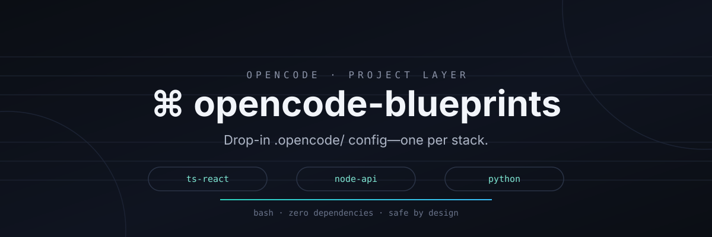

<div align="center">



**Setup OpenCode per-proyek — config `.opencode/` siap pakai, satu per stack.**

Satu perintah, dan OpenCode kamu langsung dapat konfigurasi yang disesuaikan stack untuk proyek yang sedang dikerjakan — permission, AGENTS.md, agent, dan command, semuanya di dalam `.opencode/`.

[](https://github.com/kiraadityaa/opencode-blueprints/actions)
[](LICENSE)
[](https://github.com/kiraadityaa/opencode-blueprints/releases)
[](CONTRIBUTING.md)
[](https://github.com/kiraadityaa/setup-opencode)
[](https://github.com/kiraadityaa/opencode-doctor)

[English](README.md) · **Bahasa Indonesia**

</div>

---

## Apa ini?

OpenCode membaca config **global** dari `~/.config/opencode/` dan config **proyek** dari `.opencode/` di samping proyek kamu. Setup global ([setup-opencode](https://github.com/kiraadityaa/setup-opencode)) cocok untuk *di mana saja*. Tapi tiap proyek butuh aturan yang berbeda:

| | Global (`setup-opencode`) | Per-proyek (**repo ini**) |
|---|---|---|
| Dipasang ke | `~/.config/opencode/` | `.opencode/` di dalam proyek kamu |
| Cakupan | Semua proyek di mesin | Hanya repo tempat kamu memasangnya |
| Cocok untuk | Default seluruh mesin, MCP, skills | Permission, agent, command spesifik stack |
| Contoh | sudo allow, aturan git, MCP memory | `npm publish: deny` untuk frontend, izin `uv` untuk Python |

**opencode-blueprints** menyediakan config proyek siap pakai yang di-tune per stack. Pilih satu, jalankan satu perintah, selesai.

## ✨ Fitur

- **Satu perintah, tanpa dependensi** — script bash tunggal (`blueprint.sh`), tidak butuh npm/pip. Deploy ke folder `.opencode/` biasa.
- **Di-tune per stack** — tiap blueprint membawa aturan `permission.bash` yang tepat (mis. `npm publish: deny` untuk frontend, izin `uv`/`pytest`/`ruff`/`mypy` untuk Python), konvensi stack di `AGENTS.md`, sebuah agent, dan sebuah command.
- **Aman sejak desain** — tidak pernah menyentuh config global `~/.config/opencode/`, hanya menulis di dalam proyek tujuan, backup ke `.opencode.bak.<timestamp>` saat `--force`, dan `--dry-run` mempratinjau semua aksi.
- **`detect` stack kamu** — arahkan ke sebuah direktori, ia akan menyarankan blueprint yang cocok (bisa di-script, output `--json`, exit code 0/1).
- **Memvalidasi diri sendiri** — `blueprint.sh test all` memeriksa meta, JSON, permission, dan frontmatter; CI menjalankannya di setiap push.
- **Bisa dipakai tanpa clone** — `curl … | bash -s init <nama>` otomatis mengunduh dan meng-cache katalog.

## Cara kerjanya

```text
1. pilih         blueprint.sh list / detect .      → tentukan stack yang tepat
2. deploy        blueprint.sh init <name>          → membuat .opencode/ di proyek kamu
3. pakai         opencode                          → aturan proyek berlaku di atas config global
```

OpenCode menggabungkan config proyek di atas config global, jadi `setup-opencode` (seluruh mesin) dan blueprint (per-proyek) saling melengkapi, bukan bertabrakan.

## Blueprint yang tersedia

| Blueprint | Stack | Yang diterapkan |
|---|---|---|
| **ts-react** | TypeScript + React (Vite/Next) | npm test/build/lint/typecheck allow, dev/install ask, publish deny |
| **node-api** | API Node.js (Express/Fastify) | sama seperti di atas + `npm start` ask |
| **python** | Python (uv/pip) + pytest/ruff/mypy | uv/pytest/ruff/mypy allow, pip install ask |

Setiap blueprint membawa `opencode.json`, `AGENTS.md`, sebuah **agent** (mis. `react-reviewer`), dan sebuah **command** (mis. `/component`).

## Mulai cepat

Butuh: `bash`, `curl` (untuk blueprint remote), git.

Clone dan inisialisasi — jalankan di dalam repo proyek yang ingin dikonfigurasi:

```bash
git clone https://github.com/kiraadityaa/opencode-blueprints.git
cd opencode-blueprints && bash blueprint.sh init ts-react   # atau: node-api, python
```

Atau tanpa clone — script otomatis mengambil katalog blueprint saat pertama dijalankan:

```bash
cd /path/ke/proyek-kamu
curl -fsSL https://github.com/kiraadityaa/opencode-blueprints/raw/main/blueprint.sh | bash -s init python
```

Itu saja. Deploy tidak menghapus apa pun di mesin kamu — hanya membuat `.opencode/` di dalam proyek saat ini.

> **Posisi:** gunakan `setup-opencode` untuk config seluruh mesin, dan **opencode-blueprints** per proyek. Keduanya saling melengkapi — aturan proyek diterapkan di atas config global kamu.

## Referensi CLI

```
blueprint.sh list                 Daftar blueprint yang tersedia
blueprint.sh list --json          Sama, dalam JSON (banner disembunyikan)
blueprint.sh show <name>          Lihat detail sebuah blueprint
blueprint.sh show <name> --json   Sama, sebagai satu objek JSON
blueprint.sh detect [<path>]      Deteksi stack di sebuah direktori → saran blueprint
blueprint.sh detect <path> --json Cetak {"blueprint": "...", "detected_by": "..."}
blueprint.sh test [<name>|all]    Validasi blueprint secara lokal (exit 1 jika gagal)
blueprint.sh test all --dir <p>   Validasi folder blueprints/ di lokasi lain (mis. fork)
blueprint.sh init <name>          Terapkan blueprint ke .opencode/ proyek saat ini
blueprint.sh update               Perbarui katalog blueprint dari GitHub
blueprint.sh --version            Cetak versi lalu keluar
blueprint.sh --help               Tampilkan bantuan ini
```

`detect` memindai `package.json` (react/next/vite → `ts-react`, express/fastify → `node-api`), `pyproject.toml`/`requirements.txt`/`uv.lock` → `python`, dan memberi petunjuk stack yang belum ada blueprint-nya (`go`, `rust`, `laravel`, `docker`). Exit code 0 saat terdeteksi, 1 jika tidak — cocok untuk scripting.

`test` memvalidasi tiap `blueprints/*/`: `blueprint.meta` (`name`, `description`, `stack`, `name` harus sama dengan nama folder), `opencode.json` (JSON valid + ada aturan default `"*"` di `permission.bash`), keberadaan `AGENTS.md`, dan frontmatter `description:` pada tiap file agent/command.

### Opsi `init`

| Opsi | Keterangan |
|---|---|
| `--dir <path>` | Direktori proyek tujuan (default: direktori saat ini) — diresolusi ke `pwd -P` (anti-escape symlink) |
| `--root` | Sekaligus menulis `AGENTS.md` ke root proyek |
| `--no-agents` | Lewati agent bawaan stack |
| `--no-commands` | Lewati command bawaan stack |
| `--force` | Tindih `.opencode` yang ada (di-backup ke `.opencode.bak.<ts>` dulu) |
| `--dry-run` | Pratinjau aksi tanpa mengubah apa pun |
| `--verbose` | Tampilkan setiap perintah yang dijalankan |

### Yang dibuat `init`

```
proyek-kamu/
└── .opencode/
    ├── opencode.json     # config proyek: AGENTS.md + permission stack
    ├── AGENTS.md         # konvensi stack + rules for agents
    ├── agents/           # mis. react-reviewer.md, api-reviewer.md
    └── commands/         # mis. component.md, endpoint.md
```

`opencode.json` mengatur `"instructions": ["AGENTS.md"]` (diresolusi relatif terhadap `.opencode/`) sehingga OpenCode memuat aturan stack otomatis.

## Menambahkan blueprint

Blueprint berada di `blueprints/`. Masing-masing berupa folder:

```
blueprints/<name>/
├── blueprint.meta       # name, description, stack, effort, keywords, aliases
├── opencode.json        # config proyek JSON valid (divalidasi di CI)
├── AGENTS.md            # konvensi stack + rules for agents
├── agents/*.md          # agent bawaan stack (opsional)
├── commands/*.md        # command bawaan stack (opsional)
└── README.md            # deskripsi singkat untuk manusia
```

Deploy ke mesin ini aman sejak desain:

- Script **tidak pernah menyentuh** config global `~/.config/opencode/` kamu.
- Ia hanya menulis di dalam proyek tujuan (`.opencode/`, plus `AGENTS.md` di root hanya dengan `--root`).
- `.opencode` yang ada hanya ditindih dengan `--force`, setelah backup ber-timestamp.

## FAQ

<details>
<summary><b>Bagaimana cara membatalkan blueprint?</b></summary>

```bash
rm -rf .opencode
```

Config global OpenCode kamu tidak tersentuh, jadi tidak ada hal lain yang terpengaruh.

</details>

<details>
<summary><b>Bagaimana kalau `.opencode/opencode.json` sudah ada?</b></summary>

`init` akan bertanya sebelum menindih. Dengan `--force`, folder lama di-backup ke `.opencode.bak.<timestamp>` lalu di-deploy ulang.

</details>

<details>
<summary><b>Apakah blok permission menggantikan aturan global saya?</b></summary>

Tidak. Config proyek melengkapi config global — OpenCode menggabungkannya. Blueprint hanya menambah aturan yang disesuaikan stack di atasnya (mis. `npm publish: deny`).

</details>

<details>
<summary><b>Bisa dipakai tanpa clone?</b></summary>

Bisa — varian pipa `curl … | bash -s init <nama>` otomatis mengunduh dan meng-cache katalog ke `~/.cache/opencode-blueprints/`. Jalankan `update` untuk menyegarkannya.

</details>

## Struktur proyek

```
.
├── blueprint.sh          # CLI-nya (bash, tanpa dependensi)
├── blueprints/
│   ├── ts-react/         # TypeScript + React (Vite/Next)
│   ├── node-api/         # API Node.js (Express/Fastify)
│   └── python/           # Python (uv/pip)
├── VERSION               # versi saat ini (SemVer)
├── .github/workflows/    # CI: shellcheck + validasi + smoke test init
└── LICENSE               # MIT
```

## Pengembangan

Lihat [CONTRIBUTING.md](CONTRIBUTING.md). Setiap perubahan pada `blueprints/*` atau `blueprint.sh` divalidasi di CI: `shellcheck` pada script, `blueprint.sh test all` (meta + JSON + permission + frontmatter), smoke test `detect`, dan smoke test `init` end-to-end.

## Ucapan terima kasih

- [opencode](https://github.com/anomalyco/opencode) — agent AI coding yang dikonfigurasi oleh blueprint ini.
- [setup-opencode](https://github.com/kiraadityaa/setup-opencode) — repo pendamping untuk config OpenCode seluruh mesin; blueprint dibangun di atasnya.
- [opencode-doctor](https://github.com/kiraadityaa/opencode-doctor) — CLI pemeriksa kesehatan (`bash doctor.sh --json`) untuk mendiagnosis dan memperbaiki config OpenCode global maupun proyek.
- [anthropics/skills](https://github.com/anthropics/skills) — referensi konvensi file agent/command yang dipakai di `setup-opencode`.

## Lisensi

[MIT](LICENSE) © kazehaya aditya